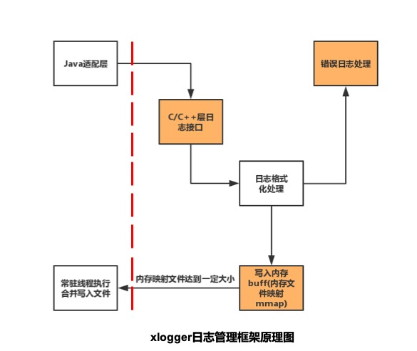

xlogger日志管理框架
1 简介：
xlogger是一个仿Mars Xlogger的高性能日志收集框架，主要服务于需要c层和java层同时收集日志内容的终端基础组件。
2 特点：
1）不再需要加密和压缩相关操作代码，场景相对简单；
2）对boost库进行了裁剪，压缩编译出来的so库release版本大小至180k，不需要像Mars Xlogger一样依赖STL辅助库；
3）添加了Android原生的控制台打印，对日志代码本身进行日志管理；
4）使用mmap模式进行内存日志临时文件保存，实现了高效的日志收集；
5）相较于传统的日志收集框架，将java层和c层的日志收集工作通过jni方式连接起来，适用性更广泛；
3 xlogger原理：
xlogger日志管理框架的原理图如下：

4 使用：
1）c层使用，将编译出来的libxlogger.so置于需要收集日志的c层代码中，CmakeList方式（或其他）引入，调用
Java_com_ximalaya_ting_android_xlogger_XLoggerJNI_appenderOpen进行初始化（java和c层只需调用一次）， 
调用xlogger_Write(&xlog_info, log_jst.GetChar());进行日志写入操作；
2）java层使用
static {
System.loadLibrary("xlogger");
} 
引入so库。
String path=MainActivity.this.getApplicationContext().getFilesDir().toString();
XLoggerJNI xLogerJNI=new XLoggerJNI();
xLogerJNI.appenderOpen(1, 0, path+"/ximalayacache", path+"/ximalayalog", "y-log", 0);
设置文件缓存路径（Android对应用写操有写权限，只能在自己应用目录下进行操作）;
XLoggerInfo xLoggerInfo=new XLoggerInfo();
xLoggerInfo.filename="yu";
xLoggerInfo.funcname="ok";
xLoggerInfo.level=1;
xLoggerInfo.pid=0;
xLoggerInfo.tag="yucollect";
xLoggerInfo.tid=2;
xLoggerInfo.maintid=2;
xLogerJNI.logWrite(xLoggerInfo, "my name is yulinfeng"+i);
定义对象，java层执行写入操作；
